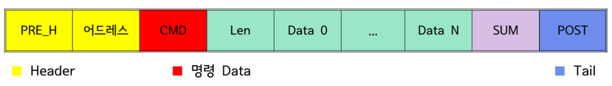

# 통신과 판정 구조

[프로젝트 개요](README.md)

## MCU와 Edge 장치의 역할

MCU는 센서 인터럽트, 게임 상태, 점수와 출력 장치를 제어합니다. Raspberry Pi는 카메라 입력과 AI 추론을 처리합니다. 센서 이벤트를 시작점으로 판정 요청과 응답이 오가며, 결과가 메인보드의 출력으로 이어집니다.

## 통신 프레임

| 필드 | 자료에 표시된 역할 |
| --- | --- |
| PRE_H | 프레임 헤더 |
| Address | 대상 장치 주소 |
| CMD | 타격 요청 또는 좌표 결과 등의 명령 종류 |
| Len | 데이터 길이 |
| Data 0~N | 타겟 번호, X/Y 좌표, 판정 결과 등의 데이터 |
| SUM | 프레임의 합계 필드 |
| POST | 프레임 끝 표시 |

RF 모듈의 인터페이스는 UART 9600 bps입니다. SUM의 계산식, 바이트 순서와 재전송 정책은 제공된 자료에 없어 임의로 정의하지 않습니다.

## 좌표와 게임 판정

카메라에서 검출한 위치를 24×24 LED 격자 좌표로 바꾼 뒤 유효 영역과 점수에 반영합니다. 영상 검출, 격자 변환, 통신 반환과 장치 출력은 서로 다른 단계입니다. 검출 화면은 좌표 변환을 보여주지만 전체 경기 판정의 정확도를 검증하는 평가표는 아닙니다.

## 운영 버전 구분

| 버전 | 타격 감지 | 위치 판정 | 사용 맥락 |
| --- | --- | --- | --- |
| 개발 버전 | 충격 센서 | 카메라와 AI | 격자 좌표 검출 및 통합 개발 |
| 행사 운영 | 충격 센서 중심 | 카메라 위치 판정 제외 | 연속 이용 시 촬영 및 분석 대기 축소 |

자료: 자기소개 발표자료 19~23쪽, 프로젝트 문제 해결 경험.
