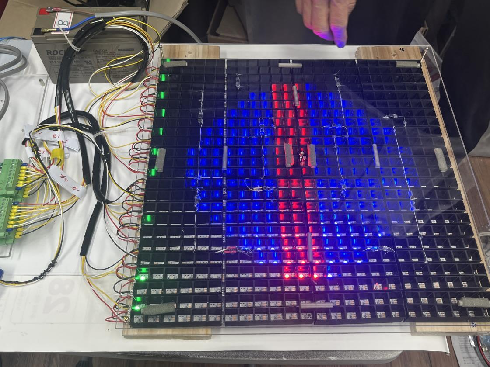
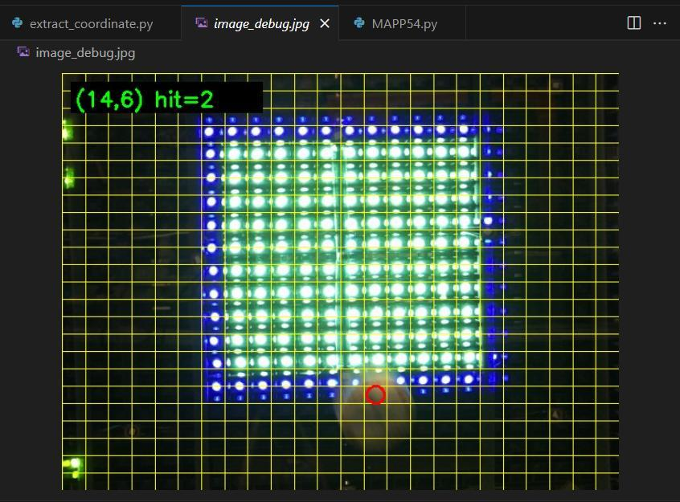
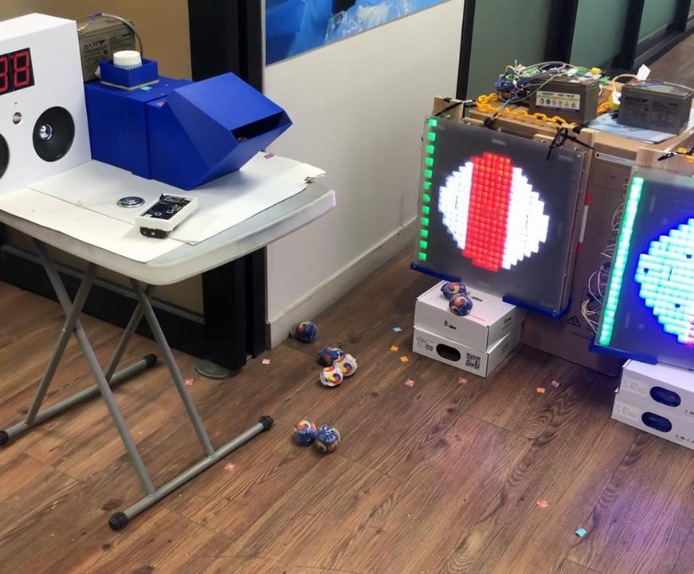

# Digital 박 터뜨리기 | 체험형 Edge AI 경기 시스템

충격 센서로 타격 시점을 감지하고, Raspberry Pi의 영상 분석으로 타격 위치를 LED 격자에 연결한 체험형 시스템입니다. MCU가 게임 상태와 출력 장치를 제어하고, 연산이 필요한 영상 판정은 별도 장치에서 수행합니다.

*2025 메이커 운동회 프로젝트의 실제 제작 장치. 24×24 NeoPixel과 센서, 배선 구성을 볼 수 있습니다.*

**본인 역할:** 3인 팀에서 센서와 Vision 기반 판정 구조를 개발하고 현장 운영과 오류 대응을 수행했습니다.

[통신 및 판정 구조](ARCHITECTURE.md) | [장치 및 검출 화면](GALLERY.md)

## 설계 목표

타격 위치마다 센서를 설치하는 대신, 충격 이벤트가 발생하면 영상을 분석해 위치를 판단했습니다. 실시간 입출력과 AI 추론을 분리해 센서 처리와 영상 분석의 역할을 나눴습니다.

| 구성 | 담당 기능 |
| --- | --- |
| NUC126 / ARM Cortex-M0 | GPIO 인터럽트 기반 타격 감지, 게임 상태와 점수 관리 |
| Raspberry Pi 5와 카메라 | 영상 입력, 학습 모델 추론, 타격 좌표 검출 |
| 400 MHz RF / UART 9600 bps | 판정 요청과 좌표 및 결과 전달 |
| 24×24 NeoPixel | 타격 위치와 게임 상태 표시 |
| 모터, 펌프, 음향 | 판정 결과에 따른 물리적 피드백 |

## 타격 판정 과정

1. 충격 센서가 타격 이벤트를 감지합니다.
2. MCU가 Raspberry Pi에 촬영 및 판정 요청을 전달합니다.
3. 충격 전후 프레임과 YOLO 검출을 이용해 새 콩주머니 위치를 확인합니다.
4. 검출 위치를 24×24 LED 격자의 좌표로 변환합니다.
5. 좌표와 유효 타격 결과를 MCU에 반환하고 점수와 출력 장치에 반영합니다.

*영상 좌표를 LED 격자로 대응시킨 디버깅 화면. 표시된 좌표는 한 사례이며 검출 정확도 지표는 아닙니다.*

## 문제 해결

### 충격이 전달되지 않아 타격이 누락되는 문제

센서 감도뿐 아니라 충격 전달 구조를 점검했습니다. 하부 지지 부품의 위치와 재질을 조정하고 반복 타격으로 동작을 확인했습니다. 소프트웨어 입력값만으로 원인을 한정하지 않고 장치 구조까지 확인한 사례입니다.

### 현장 이용 속도에 맞춘 기능 조정

행사에서는 학생들이 연속해서 장치를 사용했습니다. 촬영과 분석 대기를 줄이기 위해 카메라 위치 판정을 제외하고 충격 감지 중심으로 운영했습니다. 영상 판정을 포함한 개발 버전과 행사 운영 버전의 기능 범위를 구분합니다.

## 자료와 공개 범위

「260910_자기소개발표자료_김조은」 18~23쪽의 장치, 통신 및 검출 화면을 수록했습니다. 소스코드와 학습 데이터는 포함하지 않으며, 정량적인 정확도나 지연 시간은 제시하지 않습니다.
